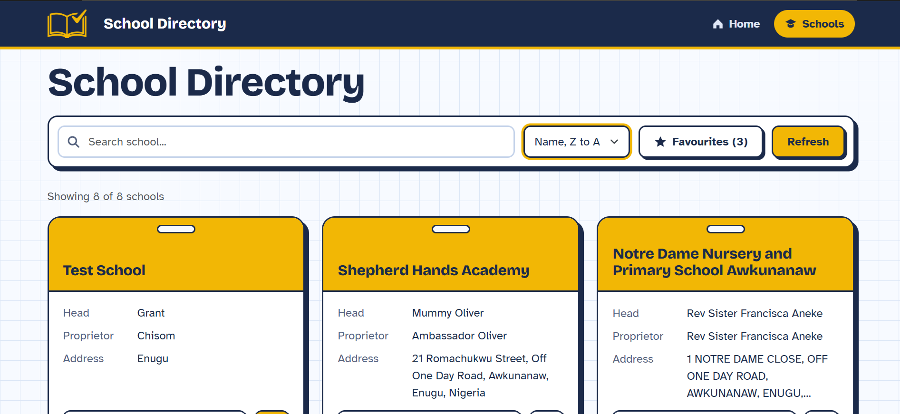
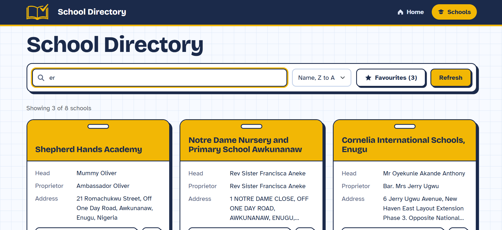
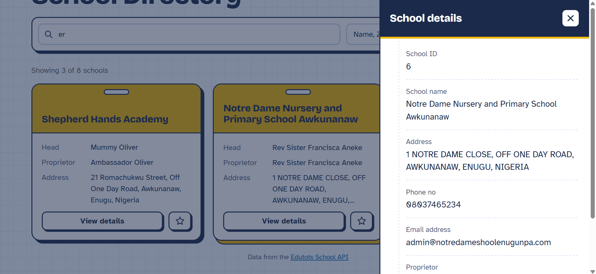
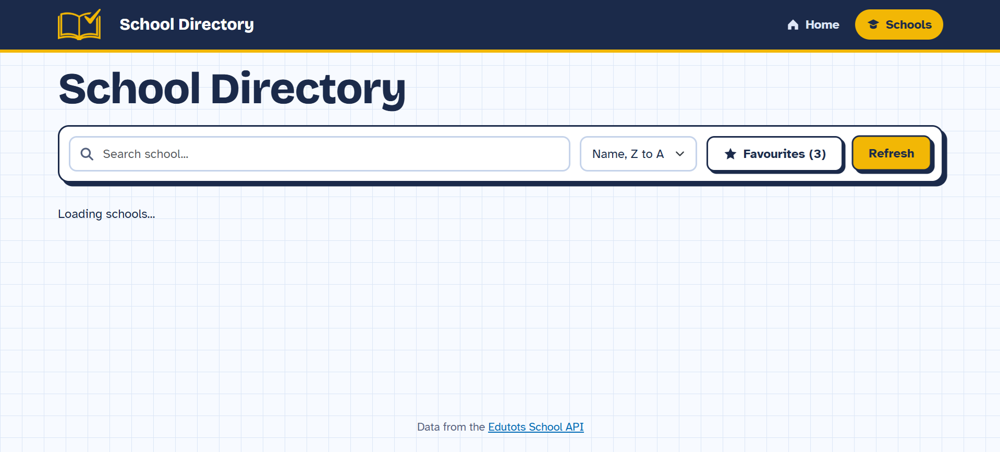
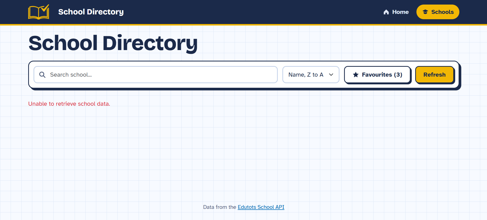
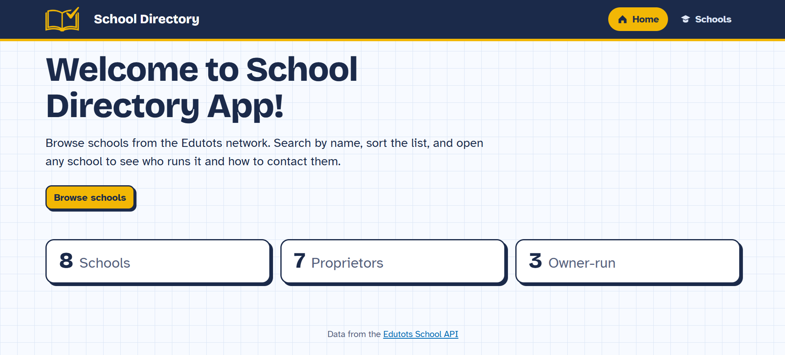
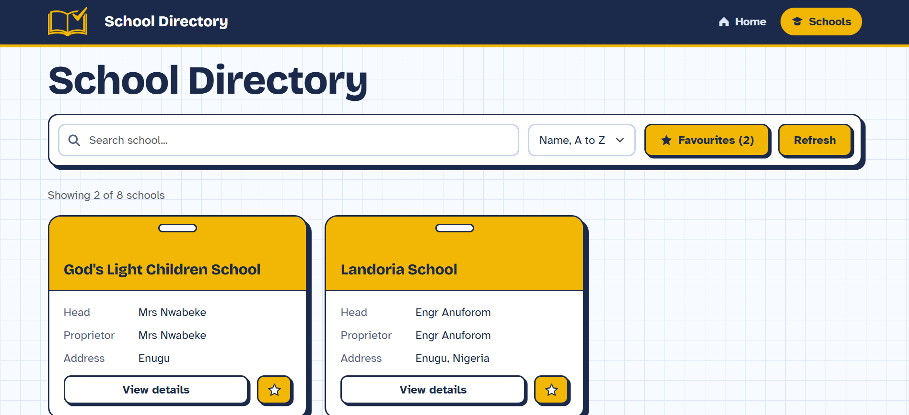
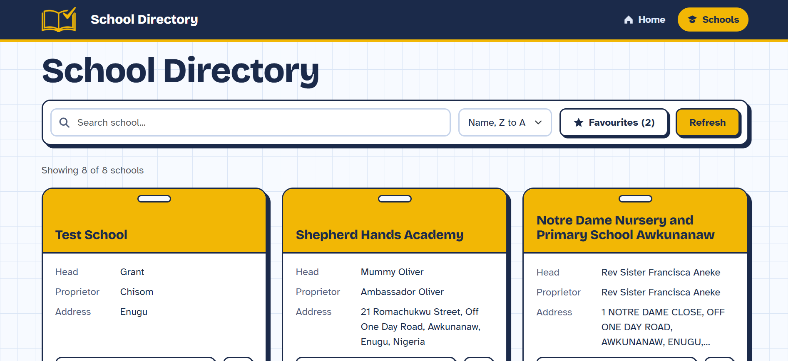

# School Directory Dashboard

### Overview
A Blazor Web Application that consumes data from the Edutots School API and presents school information through a clean, interactive interface. Users can search, sort and favourite schools, open a details panel for each school, and see summary statistics on the home page.

### 🚀 Features

✅ Retrieves schools from a third-party API using `HttpClient`  
✅ Searchable list with live filtering by school name  
✅ Sorting by name (A to Z and Z to A)  
✅ School details panel with the selected fields  
✅ Loading and error states  
✅ Refresh button to reload data from the API  
✅ Favourite schools, saved in the browser (`ProtectedLocalStorage`)  
✅ Favourites filter with a live counter  
✅ Statistics dashboard on the home page:
- Total schools
- Unique proprietors
- Owner-run schools (head and proprietor are the same person)

✅ Responsive Bootstrap layout

### 🌐 API Endpoint

```
GET https://edutots.net/api/school
```

Only the fields required by the app are mapped to the `School` model (`SchoolId`, `SchoolName`, `Address`, `PhoneNo`, `EmailAddress`, `ProprietorFullName`, `HeadFullName`).

### 📂 Project Structure

SchoolDirectoryApp/  
│  
├── Models/  
│   └── School.cs # API model  
│  
├── Services/  
│   ├── ISchoolService.cs  
│   ├── SchoolService.cs # Loads schools from the API  
│   ├── IFavouritesService.cs  
│   └── FavouritesService.cs # Favourites stored in browser local storage  
│  
├── Components/  
│   ├── SchoolCard.razor # Reusable school card (Parameters + EventCallback)  
│   ├── SchoolDetails.razor # Details side panel  
│   ├── SchoolStats.razor # Statistics tiles  
│   ├── Layout/ # Header, navigation, footer  
│   └── Pages/  
│       ├── Home.razor # Dashboard  
│       └── Schools.razor # School list  
│  
├── wwwroot/ # CSS, images  
└── Program.cs # Entry point and service registration

### 🛠 Technologies Used
- C# / .NET 10
- Blazor Web App (Interactive Server)
- HttpClient and System.Text.Json
- Bootstrap 5
- Custom CSS

### 🔧 Installation & Usage
The .NET 10 SDK and an internet connection are required.

Run the application:

```bash
git clone https://github.com/Oleg-Dergunov/SchoolDirectoryApp.git
cd SchoolDirectoryApp/SchoolDirectoryApp
dotnet run
```

Then open the address shown in the console (for example `https://localhost:7262`).

### 📸 Screenshots

**School list loaded**



Fewer points on the school card is a deliberate design decision.
Full information about the school is in the sliding Details panel.

**Search**



**School details**



**Loading state**



**Error state**



**Bonus features**

Statistics dashboard (home page):



Favourites filtering:



Sorting (Z to A):

